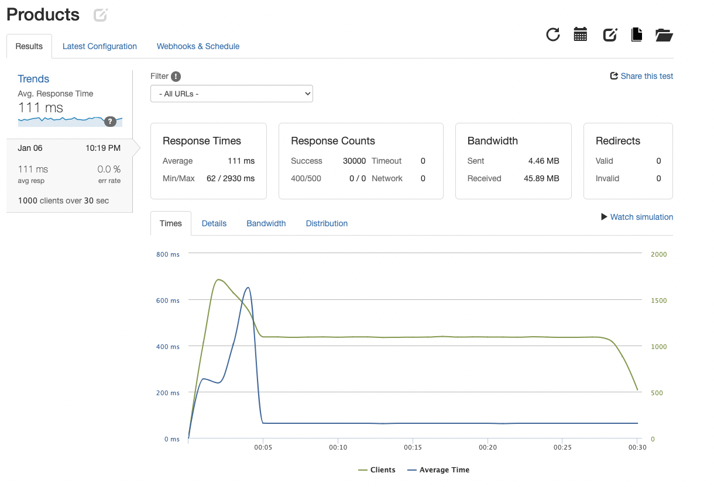
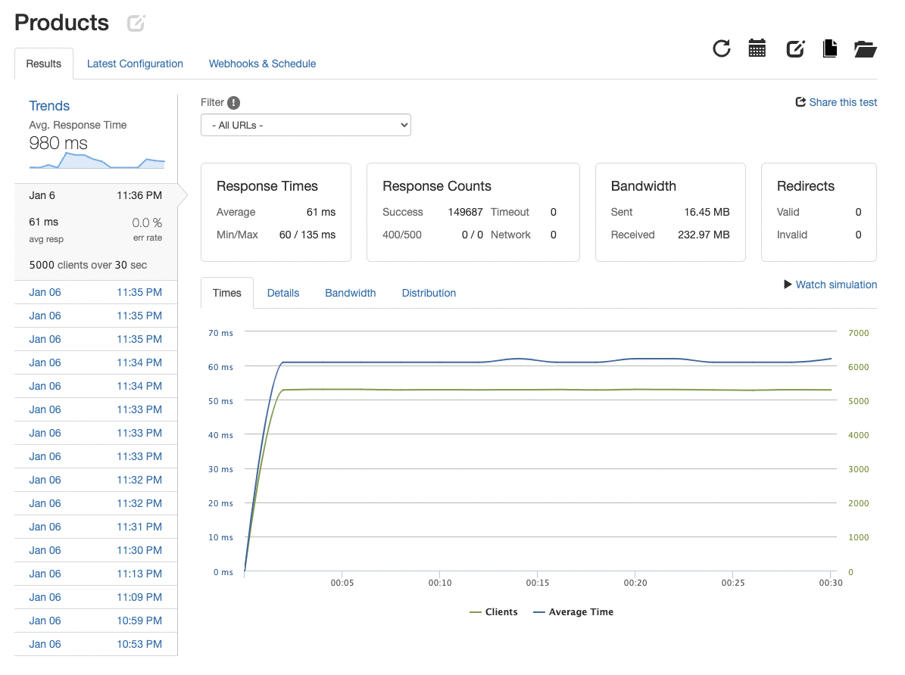

# Products API

### Table of Contents
1. [General Info](#general-info)
2. [Performance](#performance)
3. [Optimization](#optimization)
4. [Tech Stack](#tech)
5. [Team](#team)

### General Info

Implemented improved Products API to meet 1k request per second requirement.

Postgres

### Perfomance

Back End Architecture utilizes AWS to deploy a load balancer with a cache, 3 servers, and a Postgres database. All load tests performed via Loader.io.

  
Typical Load Performance

  #### Typical 1000 RPS Load

  Perfomance at typical load of 1000 clients per second. 4ms latency and 0% error

  

### Optimization

Cache Implementation

  #### Cache Performance

  Cache and load balancer implemented using Nginx - Latency has decreased by almost 50% to an average of 61ms and can handle up to 5000rps with a 0% error rate.

  

### Tech Stack

  

Product Detail: Thomas Saldana\

